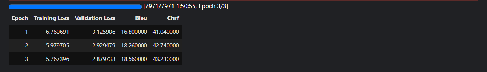
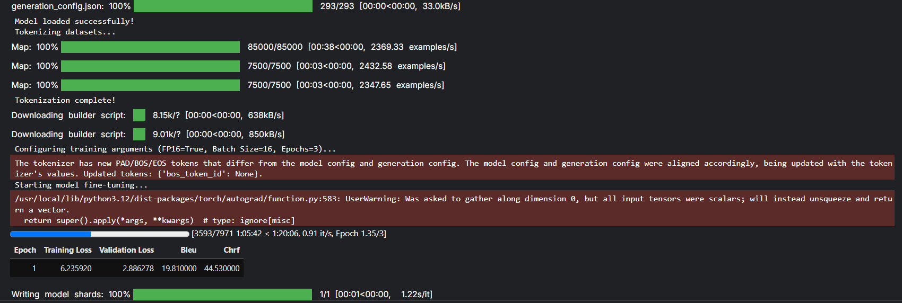

# OmniBind - Gurmukhi Punjabi, Hindi, and English Neural Machine Translation Framework

A complete, end-to-end Machine Translation project fine-tuning **Helsinki-NLP MarianMT** models on the **Anuvaad Parallel Corpora** (supporting both Gurmukhi Punjabi ↔ English and Hindi ↔ English), optimized for **100,000 sampled sentence pairs** trained on **Kaggle T4 GPUs**.

---

## 📌 Features
- **Multi-Language Support**: Fully generalized pipeline that works for Punjabi ↔ English and Hindi ↔ English translation datasets.
- **Cleaned Data Subset Engine**: Preprocesses raw sentence pairs, applies Unicode NFC normalization (crucial for Gurmukhi and Devanagari script consistency), deduplicates, and extracts 100k high-quality sentence pairs.
- **Self-Contained Training Script (`train.py`)**: Automatic dependency bootloader, GPU optimization, and metric tracking compatibility with both Jupyter/Colab and local runtimes.
- **Automated Metric Evaluation**: Evaluates translation quality using standard **sacreBLEU** and **chrF++**.
- **Interactive Gradio Web App (`app.py`)**: Dynamic loading of unidirectional models depending on language selection with support for local fine-tuned checkpoints.

---

## 📐 Methodology Flowchart


---

## 📁 Repository Directory Structure

```text
OmniBind/
├── data/
│   ├── punjabi/               # Raw Punjabi parallel corpus files (.xml and structure)
│   │   └── Anuvaad.en-pa.xml
│   ├── hindi/                 # Raw Hindi parallel corpus files (.xml and structure)
│   │   ├── Anuvaad.en-hi.xml
│   │   ├── README
│   │   └── LICENSE
│   └── processed/             # Cleaned & sampled 100k datasets
│       ├── punjabi_english_100k.csv
│       └── hindi_english_100k.csv
├── src/
│   └── preprocess.py          # Data cleaning, deduplication & sampling engine
├── .gitignore                 # Configured to exclude raw files from git tracking
├── README.md                  # Project documentation & step-by-step guide
├── requirements.txt           # Python dependencies
├── config.yaml                # Hyperparameters & path configurations
├── app.py                     # Gradio Web Interface for Live Translation
├── train_punjabi.py           # Standalone Punjabi-to-English training script
└── train_hindi.py             # Standalone Hindi-to-English training script
```

---

## 🚀 Quick Start Guide

### Step 1: Preprocess Data Locally (Optional)
The preprocessed 100k datasets are already generated and committed in `data/processed/`. If you want to re-run preprocessing on new datasets, use the generic script:

```bash
# For Punjabi-English
python src/preprocess.py --en data/punjabi/Anuvaad.en-pa.en --target data/punjabi/Anuvaad.en-pa.pa --output data/processed/punjabi_english_100k.csv --col_name punjabi

# For Hindi-English
python src/preprocess.py --en data/hindi/Anuvaad.en-hi.en --target data/hindi/Anuvaad.en-hi.hi --output data/processed/hindi_english_100k.csv --col_name hindi
```

---

### Step 2: Fine-Tune on Kaggle GPU (10–15 Minutes)

1. Open **[Kaggle](https://www.kaggle.com)** and create a new **Notebook**.
2. Upload the dataset file you want to train along with its corresponding training script:
   - For Punjabi: Upload `punjabi_english_100k.csv` and `train_punjabi.py`.
   - For Hindi: Upload `hindi_english_100k.csv` and `train_hindi.py`.
3. Set your accelerator under notebook settings to **GPU T4** (or GPU T4 x2).
4. Run the training script in a cell:
   - For Punjabi:
     ```python
     !python train_punjabi.py
     ```
   - For Hindi:
     ```python
     !python train_hindi.py
     ```
   *Note: All library requirements are automatically verified and installed by the script.*
5. Once completed, download the model archive `punjabi_english_marian_final.zip` (or `hindi_english_marian_final.zip`) from Kaggle.

---

### Step 3: Run the Web UI Application

1. Install local dependencies:
   ```bash
   pip install -r requirements.txt
   ```
2. Unzip your trained model checkpoint into your local directory.
3. Launch the Gradio Web App:
   ```bash
   python app.py
   ```
4. Open the link `http://127.0.0.1:7860` in your browser to perform live translation.

---

## 📊 Evaluation & Metrics

### Target Metrics
- **sacreBLEU**: Standard NMT n-gram precision metric (Target: `> 25.0`)
- **chrF / chrF++**: Character-level n-gram F-score (Target: `> 50.0`)

### Training Progress Results

Below is the epoch-by-epoch training progress and translation metrics extracted from the training logs on Kaggle (T4 GPU):

#### 1. English ↔ Hindi (`Helsinki-NLP/opus-mt-hi-en`)
* **Dataset Size:** 100k pairs (85,000 train, 7,500 validation, 7,500 test)
* **Training Time:** ~1 hour 50 minutes (3 epochs)

| Epoch | Training Loss | Validation Loss | Validation BLEU | Validation chrF |
| :---: | :---: | :---: | :---: | :---: |
| **1** | 6.760691 | 3.125986 | 16.80 | 41.04 |
| **2** | 5.979705 | 2.929479 | 18.26 | 42.74 |
| **3** | 5.767396 | 2.879738 | **18.56** | **43.23** |



#### 2. English ↔ Punjabi (`Helsinki-NLP/opus-mt-pa-en`)
* **Dataset Size:** 100k pairs (85,000 train, 7,500 validation, 7,500 test)

| Epoch | Training Loss | Validation Loss | Validation BLEU | Validation chrF |
| :---: | :---: | :---: | :---: | :---: |
| **1** | 6.235920 | 2.886278 | **19.81** | **44.53** |
| **2** | *[In Progress]* | *[Pending]* | *[Pending]* | *[Pending]* |
| **3** | *[Pending]* | *[Pending]* | *[Pending]* | *[Pending]* |



---

## 📜 Dataset Citation & License
This project utilizes datasets from the **Anuvaad Parallel Corpus** on **OPUS**:
- License: CC-BY-4.0
- Citation: J. Tiedemann, 2012, *Parallel Data, Tools and Interfaces in OPUS*. In Proceedings of LREC 2012.
